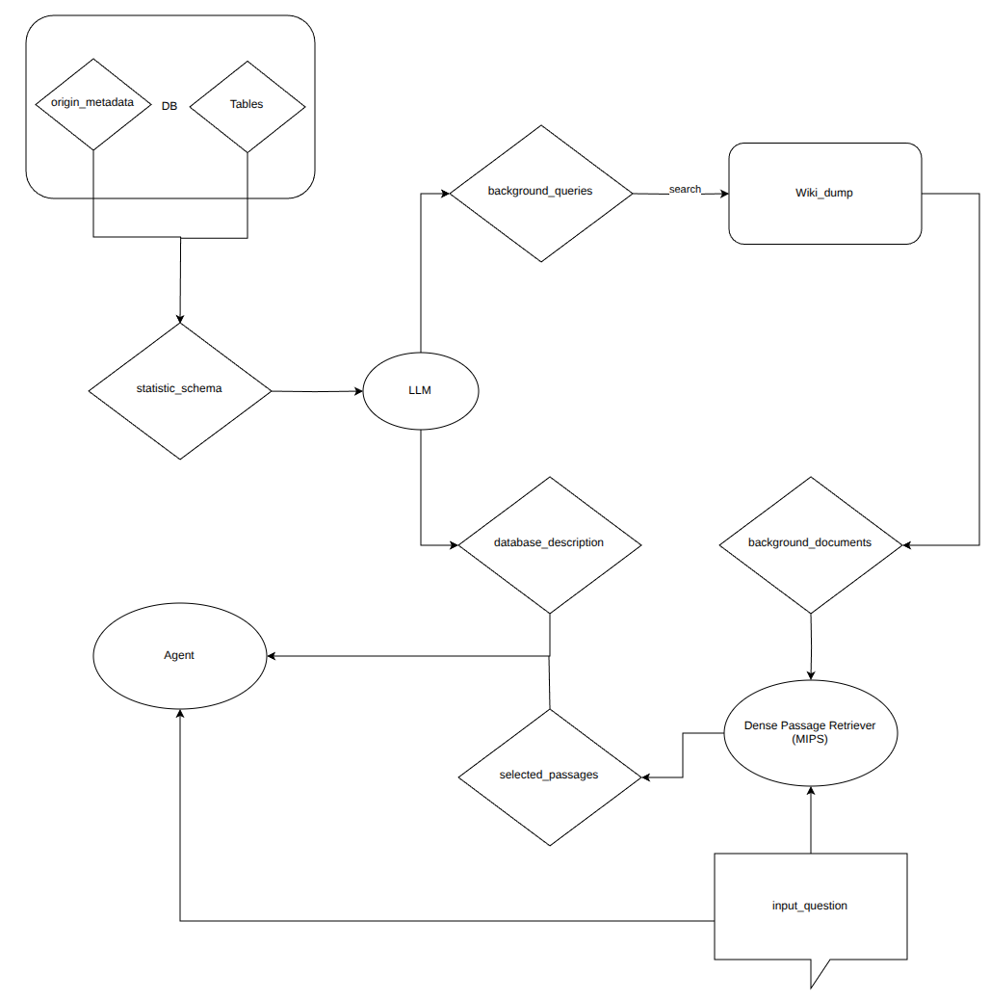
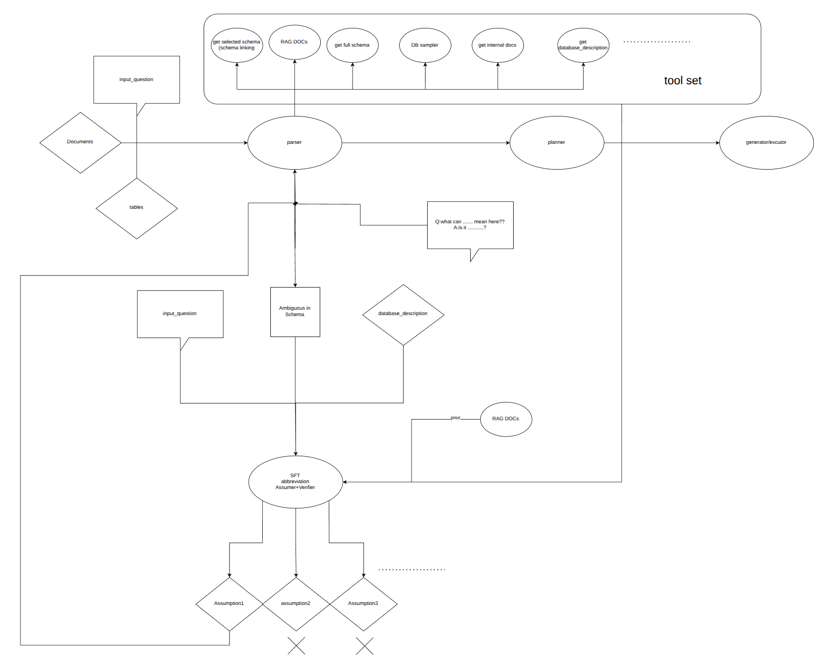

## 7.27
- background-documentSource1: wiki dump, link whole wiki-documents with database
- background-documentSource2: industry ducoments.
- database_description simulates the description human might input.
- RAG combined: use MIPS retriver,just encoders, selet top-k 100-word passages(Maximum Inner Product Search). 
 
## 7.29
- instead using column names to match querys to fetch the column description, using column descriptions' embedding vector to match queries' key words might be better.
- 1 paper Chess 
- feishu documents async
- building auto wiki search for dataset constructing 
## 7.30
- idea：考虑没有用户background_document输入的情况，后续直接用wiki_dump做模糊匹配搜索（需要87G
- idea: makeing LLM do references about ambigious metadata, making candidates, assign scores.
- 1work: add vector similarity module in document and subjuct.
- IDEA: self-RAG: training LM using special tokens while generating to determin weather do the search or not.
- IDEA: self-RAG的data-collection 可以作为参考文献：使用强LLM对原始训练语料进行标注：引入外部网络资料是否会帮助产生更好的结果：
```
Given an instruction, make a judgment on whether finding some external documents from the web helps to generate a better response.
```
## 7.31
- work: using mutiple searching candidates for more similarity results.
- investigate web search engine used in self-RAG Luo et al. (2023)
- COT论文

- retrieval-assumption-verification for ambiguous tabular QA

- 文档本身是解决方法而不是问题，问题是**如何模型让模型理解本身非常难以理解的表格schema**，并写出准确的代码、用正确的参数调用合适的工具、总结出有效的结论。详细的配套说明文档比较难生成，而当这种文档被生成的时候，上面的问题已经被解决了。也就是说，如果从这个出发点定义这项工作，就会变成一个文档收集任务(RAG)。
- 针对以上问题，可以将文档分成两部分：1.可以轻易获得的文档，随表格和query一起输入。2.用search-augment获取的文档，集成在tool里，agent根据需要调用。

- 表格难以理解，问题的痛点在模糊和歧义。体现在表格schema含义的模糊歧义和用户输入问题的歧义上。
- 针对以上问题，可以让模型找到模糊的点，根据这个点发散地假设可能的含义，然后验证。
- 微调assumer模型，让他根据输入的模糊点x，简单的背景介绍和用户query生成假设。不同假设根据是否合理，是否有DBsample支持，是否有文档支持assign score排序，每轮取top，返给上层模型或用户验证

- parser模型负责调用assumer，parser接受表格，背景文档和用户问题，分析出表格的主题和用户的意图，给出自然语言解决方案
- generator接受parser的自然语言并生成代码或调用数据分析工具


- structured prompt designs that explicitly verify assumptions： Hypothesis Testing Prompting

- assumer generates every assumption in one scentence(segment).verifier checks using tools and experience. 

- verifier训练可以考虑强化学习，只有对和不对两种

## 8.1
- document策略修改， 大规模爬虫


## 8.3
- 阅读论文CHESS: CONTEXTUAL HARNESSING FOR EFFICIENT SQL SYNTHESIS
  - 训练四个agent：Information Retriever (IR), Schema Selector (SS), Candidate Generator (CG), the Unit Tester (UT) 处理表格问答
  - IR和SS共同组成schema-linking，挑选与用户输入相关性强的metadata输入LLM，使用局部敏感哈系LSH做第一轮相似度匹配，词向量余弦相似度做第二轮匹配。
  - 笔记在https://walkiiiy.github.io/2025/07/29/CHESS:%20CONTEXTUAL%20HARNESSING%20FOR%20EFFICIENT%20SQL%20SYNTHESIS/
- 阅读论文SELF-RAG: LEARNING TO RETRIEVE, GENERATE, AND CRITIQUE THROUGH SELF-REFLECTION
  - 传统RAG无法自己判断是否需要进行文档搜索，也无法判断根据文档输出的结果是否有幻觉，self-RAG在预训练模型基础上加入四个特殊的reflect-token解决了上述问题。
对7b模型微调，训练数据集来自GPT对开放问答数据集的二次加工
  - 笔记在https://walkiiiy.github.io/2025/07/30/Self-RAG/
- 做完两套document合成方案，先用deepseek对statistic_schema分析给出自然语言描述和背景知识query和reason，
然后与wiki_dump里的document或爬取google_search前20的page做文本向量相似度匹配，但是讨论发现两套都无法保证根据输出的document一定能推理出正确结果
- 一个合理的架构方案：
   
- 下周打算读CoT相关论文，
- 试试商用deepreseach能否达到理想的document效果，如果还不行就把架构里的parser作为document合成方案
- 还要调研chroma的词相似读匹配方法