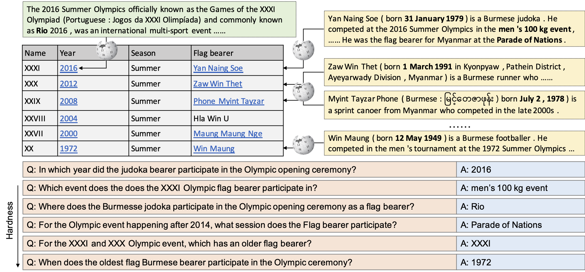
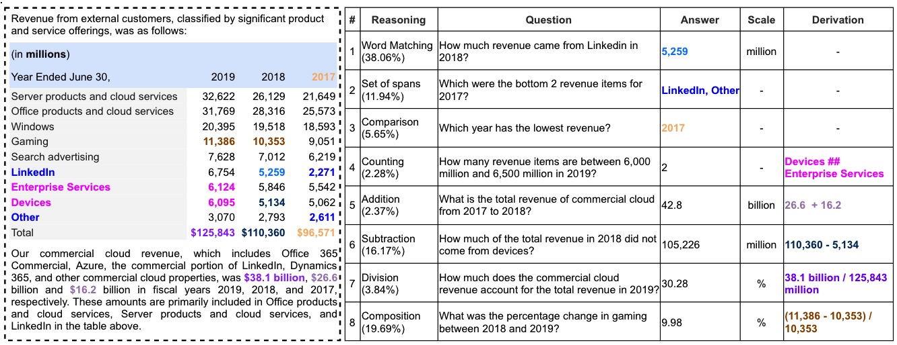

### 6.8
**topic**
明确问题：输入table和相应领域的document，模型回答query
目前找到的两个比较合适的数据集：
**Table+document+QA dataset**
- HybridQA
    - 表格+text passages+问答，表格和doc都来自Wikipedia
    - 13Ktables
    - 70K问答对
    - 优势：范围广，数量多，高质量数据 
    - 局限：结构不一样。passages是分散的，每一个passage对应到table内的每一行，一个table内平均44个text passage。可以考虑合并到一个文件并将table原本的passage列去掉。table规模普遍偏小，且内部文本偏多。

<!--  -->

- TAT-QA
    - 数据采集自企业财务年报，数字偏多
    - 16K问答对
    - 2.7K passage+table
    - 优势：格式匹配，table和doc一一对应，计算问题和理解问题都有，且计算会给推导过程。
    - 局限：表格内容全数字，问答数字分析计算偏多，文字分析和回答偏少。范围限于经济分析。每个表格只给一个passage，相对于一份doc来说偏短，table规模也不大。
 
<!--  -->
