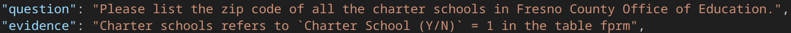

### 7.13
#### 数据集构建
**Bird数据集：**
重新考虑依据Text2SQL数据集构建，Bird缺少背景文档，正在想办法构建。
Bird的优势：
- query足够复杂
- field name模糊不清（有很多简写和歧义），而且有脏数据（重复行、单位不统一等），给了语言模型理解发挥空间
- 每个表都配有description，说明每一列名的意义，单位，用处

- 每个query都配有hint，说明该query的理解思路

调研了top2的方法：
- Automatic Metadata Extraction for Text-to-SQL
  - 每一列做profiling，LLM生成每列的详细description，生成schema
  - 结合LSH，循环schema linking，筛选相关性高的列，直到生成的sql query包含question中的全部关键词。
  - 笔记在https://walkiiiy.github.io/2025/07/09/MetadataExtractionforText-to-SQL/
- CHASE-SQL: Multi-Path Reasoning and Preference Optimized Candidate Selection in Text-to-SQL
  - 先LSH筛选高相关列（value retrival）
  - 大力出奇迹，用三种prompt方法生成不同sql query，再微调一个selection agent对所有query两两比较打分，取top。
  - 笔记在https://walkiiiy.github.io/2025/07/10/CHASE-SQL-Multi-CandidateGenerateSelectForText-to-SQL/

总的来说，前沿的方法都结合description推理列名的内在含义和关系，并通过Value retrival(schema linking)筛选query相关的列，缩小prompt长度来增强模型理解，并通过k轮循环确保结果高质量。
目前模型方法bird_test acc最高77%，人工方法92%

**备选hybridQA数据集：**
- 给每个表爬了一个背景文档，根据表内链接爬wiki文档并合并，共10651个
- hybridQA自带的query太简单，杨博说先当做备选
#### MCP
构建了简单地MCP客户端并学习写MCP服务端，写了两个tool练手，一个查区域码表查天气，一个联网搜索时事内容
#### 下周计划
- 写mcp序列化csv，sqlite文件tool，用deepseek比对测试论文中的方法
- 想想方案能把背景文档结合到bird里，bird自带的description相比背景文档来说有点简单。

# 7.10
- 要求有一些query的答案同时在doc和tab中
- **如果针对每个databse，doc不仅结合description，还用agent自动去查该领域的背景资料作为补充？**
- dev_tables.json中有colum和table的names和names_original，可以微调LLM还原names_original的能力。
- 