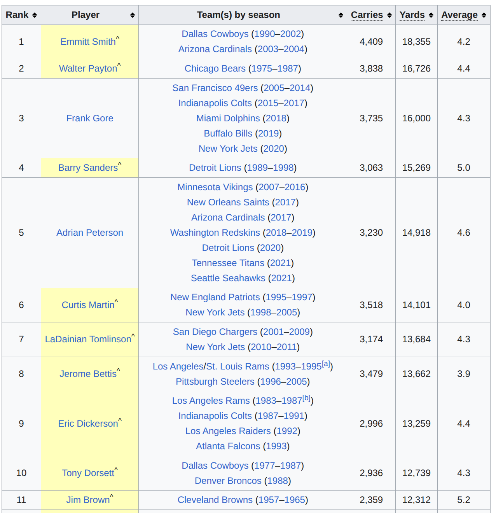

### 7.13
# 7.7
**topic**
**数据集构建**
根据hybridQA：
  
  
  - 表格与doc:共15,316个表格文件，内有超链接。提取序列化表格文本信息为json，爬取并合并表内所有超链接内的文本为txt。
    -  
  - 测试数据集自带简单问题GPT4-o准确率:

# 7.8
- 根据kaggle爬取
  - 关键词tabular numical rating10.0 csv数据集，人工找对应doc。
- 根据spider1
  - 5,693 unique complex SQL queries on 200 databases with multiple tables covering 138 different domains）
  - 要人工找对应doc，每一个表的专业领域划分不严格，且没有标注说明，找起来比较费劲。
- 根据bird
  - contains over 12,751 unique question-SQL pairs, 95 big databases with a total size of 33.4 GB
  - 人工找doc可行，37个领域，且内有表关系描述
  - query还算复杂但都是仅凭表就能回答的query。
- 人工找doc：  
  - wiki树状爬取，由根节点爬取相关链接

- 复杂query生成:

**query与文档：query是必须要table结合文档进行回答，还是只用table就行，文档只是加深table理解？也就是说query的正确答案是只在表中，还是表和文档中都有部分？**
更进一步，doc中的可以是领域描述，表说明，表关系描述（多表问答），还可以是表数据内容的补充
**生成代码还是sql语句,如果可以生成的是sql，而且query的正确答案只在表中，则可以可虑直接使用bird的query，难度应该合适。即使要求生成的是代码，也可以想办法将sql语句转代码**
代码相比sql更有优势在与可以进行图表分析

# 7.9
- 基于bird-benchmark的text2sql框架：top1_Automatic Metadata Extraction for Text-to-SQL
  - notes:https://walkiiiy.github.io/2025/07/09/MetadataExtractionforText-to-SQL/
- agent序列化文件作为api输入，先以mlp练手
  -  

# 7.10
- 要求有一些query的答案同时在doc和tab中
- **如果针对每个databse，doc不仅结合description，还用agent自动去查该领域的背景资料作为补充？**