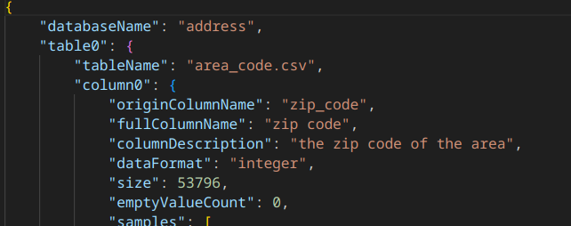
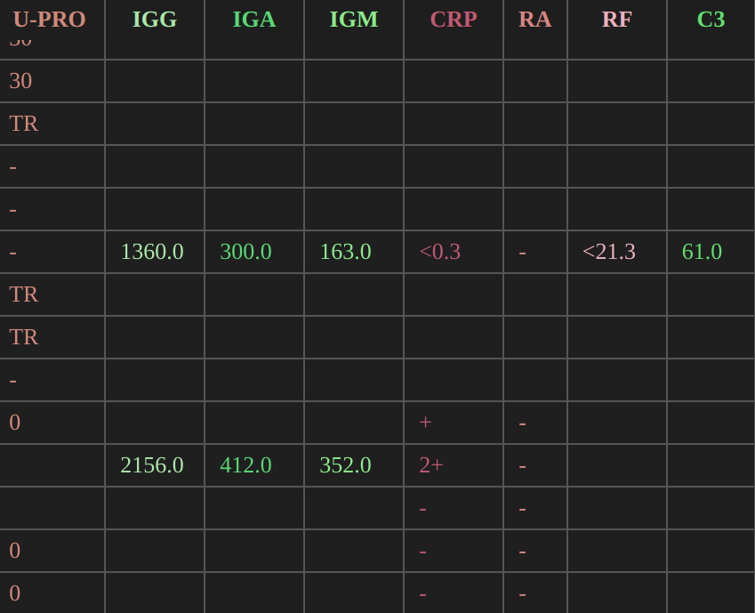

### 7.16
- 7.16
  - xiyan experiment: 
    - compares the results of a predicted SQL query and a reference SQL query executed on a specific database instance.
    - training materials from combined spider, Bird, SQL-EVAL, NL2GQL
  - dataset synthesis:
    - reference:
      - bird: los of human resources used. manully annotation and examination.
      - 
    - Basic route:
      - use deepseek v3 or finetuned model?
      - first construct a schema format of the database, the idea of profiling process in Bird_top1 can be used, this step can also use LLM for observation and conclusion. for example:
        schema
        - tablename
          - 
          - columnname
            - description
            - statistics
            <!-- !-- -  minihash -- -->
            - exampl evalus
            - measurement
            - format(might Be Different)
            - relation With Other Columns
            - relation with this lable
            - relation with the database
      - Agent1 analyze all the description csv and the tables in the database, give a guess about the main idea of the table/column/database and do the sreach
      - Agen2 select(rate) all the search res returned by Agent1, taken top_k, merge them into one specific document.(relevence looping strategy like Bird_top1 could be used here)
      - manully examine the document, see if it is relevant to the table, and if its helpful for LLM's understanding. 
- 7.17
  - record Database name info
  - long value trunction
  - nan value stastic, taking example from non-Nan value.
-----------------------------------------------------------------
  - make a description of statistics:
    - pass
  - **for a value, determain wether do the search or not**:
    - the column can be devided by its values as descrete ones and continuous ones.
      -  do quick hash for every value(e.g. python set), denote S as set length, denote L column length(dropNa), denote T as a threshold, if S/L>T, its a descrete type column. To avoid dirty value like PC,pc,personal computer, LSH and word-embedding similirty coud be used.
      -  if obscure, add the set to schema's column example.
    - the obscure can happen both in column name and in value,for obscure in value:
      - if the column type is **descrete**
      - **hard to understand**(shot name, unknown area), cant get its Purpose
      - do the search
  
  - procedure doing the search of a certain keyword:
    - Agent based search, tools api revoke required.
    - only by the key-word itself can could be hard to find, use a set of key-words and a main key-word, use different combination to do the search.(e.g. IRC it self cant get Intervention Resource Classroom)
    - references needed.

  - rate and extract top_k information from search report to a doc:
    - pass

  - link the doc to the schema,database synthesized.

----------------
p.s:
  - for a huge paramater LLM, a short description could be understood, while for a smaller LLM, short description itself might be a challenge.
  - define a decument as a NL description of the background of the database's grand background, or the background of its certain table, column, or value. As long as a place-holder is hard to understand, obscure, strange to LLM, get a doc from Internet.
  - note that wiki search to be added tomorrow.

### 7.20
- 补充Bird_top5 
  - 阿里云的XiYan-SQL：A PREVIEW OF XIYAN-SQL: A MULTI-GENERATOR ENSEMBLE FRAMEWORK FOR TEXT-TO-SQL
  - top_1,2的方法使用4-o，gemini这样的大模型，只进行few-shot prompt,而XIYAN-SQL使用参数量相对较小的32B千问模型进行SFT和prompt，
  也能达到相当的效果（但训练量大，使用四个与Bird同等级的NL2SQL训练集微调）该方法在考虑训练成本和query生成速度的综合排名中占第一。
  - 笔记在https://walkiiiy.github.io/2025/07/15/XiYan-SQL/
- NL2SQL方法总结
  - top_rank方法都可总结为三部：
    - schema describe:描述schema(meta-data)，description过于简单会使LLM无法理解表的结构，过于详细又会使上下文过长，影响推理效果。
    - schema linking：通过embedding相似度和局部敏感哈系LSH提取表中与问题相关的列，只将相关列的schema送入generator做query生成，保证最佳上下文长度和理解效果。
    - candidate generate/selection: 根据schema和用户问题生成可执行的query。selection又分为简单的语义、执行率纠错(2,5)和query相关度(1)提升，都用k轮循环改进实现。
  - top3,4没有公开论文，1，2，5的方法结构都遵从以上三部，其中2，5专注于generator，前两部的schema描述方法比较传统。top_1对描述方法、相关度进行改进，
  generator反而没有做很多文章。这可以看作消融实验，说明加强模型对表的理解比改进模型query生成能力更重要，研究每个表配备背景文档的思路可以从这里入手。
  - 杨博说数据集可以在Bird基础上构建，给每个表找背景文档。NL2SQL太卷，不做sql，要结合Agent，针对表格文档的数据分析。
- 数据集表格背景文档补全
  - 弄了Bird全部表的schema：
  - 
- 下周计划：
  - 想先找agent informtion retrieval相关的论文，看能不能和背景文档搜集结合
  - 设计完整文档搜集流程

## 7.21
- imporve schema, devide columns as discrete and continueous ones.
- wiki_search tool
- 统一wiki爬取 wiki找不到的人工找
## 7.22
- rag/agent ir 
- deerflow
- wiki agent workflow
## 7.23
- wiki_doc:only select top2 match, add target coordination in doc 1
- make schema shorter 1
- script to convert json schema to nl (could postpone, after getting a doc, combined with background info may get a better nl description)
- example: mana cost in card_games.json, no explaination, wiki unsearchable, famdom searchabe
- fandom scraper
- analyze fields and their scraper source
- another route: wikibooks fields background
- imporve prompt 1(zero shot)
- references
- workflow: wiki-search, filter, if no qulified ones found, use speciallized area search engines, filter, if still no quliffied ones found, report, use manual research.

## 7.24
- sort out the document's purpose and the model's main improvement.
- 文档类型可以有很多，数据库背景知识，列背景知识，列含义和类型详细介绍，模糊值含义详细介绍。要介绍的详细程度也可以有很多
- 没有后续模型任务的大致框架就无法确定文档的定位，无法确定文档的定位就得不到高效确定的方法获取文档。
- 当下最缺少的其实是对任务的完整定位
- 后续模型任务框架：
  - 输入表格csv(多表格 )和nl文档
  - agent调用toolSet_1生成short_schema和nl_schema(profile),short_schema只有原始列名，short_description,formats等
  - SchemaLinking,结合question，用LSH 等方法抽取合适的column profiles
  - 将2中的selected_nl_profiles和整个short_schema,question一起送入code generator agent(可以考虑中间加一层，把三者结合)code agent调用toolSet_2生成code（生成多candidates）
  - 执行，select……流程待定
- ps: 
  - 格式不对齐问题：
  
  在nl_doc中指出，并且尽量给出数据描述方法，留给code generator解决
  - 简写理解能力需要额外增强（可以考虑单独用一个agent，tool_set做信息推理和补全
- 由于输入只有csv和文档，文档中尽量要包含nl description，可以没有sample，但是要描述到位.
- 也就是说完整的文档包含两部分，nl_description和backgroound_info,但每一部分都不是必须的（虽然数据集中两者都要有），后续可以做消融实验。
- 所以问题在于强行要求在数据集构建阶段就完全理解schema，重点搞错了，过完全的数据集本身就很难合成，还会限制后续模型的发挥 。
- document构建workflow:
  - 先结合bird自带desctiption生成statistic_schema,
  - deepseek给出nl_description和需要调查的背景领域
  - **待定步骤**：agent 判断给出的nl_description是否达到要求（格式字段充足，每一column都覆盖完全，含义分析透彻），不达标的循环重复
  - 人工对生成的nl_description和key_word_list检查
  - 人工对需要调查的背景领域调查筛选（agent websearch不够成熟），得到背景文档
  - 连接background_doc和nl_description,作为数据集document
- latent imporvement(已完成):
  - make the background search key words not limited in column names, but related words. 
      for example, presume the schema is from a community like stack overflow, then do the search of "stack overflow" for better understandding.
- 是否要用k循环select继续增加数据集构建工作量？doc本身可能已经完善，提升空间不大

## 7.25
- 考虑到生成长度对比和实际应用时database_description格式不一定对齐，prompt V4没有V3好。

- document要力求在生产过程中可以人工轻易获取，构建，且对数据完整度要求不高（至少database_description部分应是弱文档不是强文档）。

- 后续验证时不必拘泥与bird，可以找其他产品方面的数据集，然后background_document找产品手册。

- **梳理定义，划分**
  - 数据集构建部分
    - origin_metadata:the csv bird offers.
    - statistic_schema: combine origin_metadata and statisticaly analyze the database, schemas in json format.
    - document
      - 包含 database_description:**强LLM**根据statistic_schema生成的简单自然语言描述，**可以看作对origin_metadata的自然语言补全**
      - 包含 background_documents：**强LLM**根据statistic_schema生成的为了理解数据库所需要了解的背景知识领域，人工搜集，汇成background_documents
  - 模型处理部分
    - document和database送入ChatTB？_Agent，生成full_schema，包含对schema描述的验证总结，对所有简写的推理阐述，所有表关系解释等。
    - ……

- 做one-shot prompt控制文档数据描述部分强弱，尽量不要太强（太详细），为后续模型schema生成保留空间（否定：doc多样性保障
- 数据集生成的是database_description和background_document合成的document，数据集生成和模型部分也可以组合成一个整体工作流（后续讨论。
- table_description可以看作对数据集自带的metadata csv的补全
- 找文献：LLMschema 分析，转nl
- VLDB一篇+chess+mac-sql
- 文献阅读量远远远远不够啊woc
- schema-linking的出处还没研究。
- RAG论文