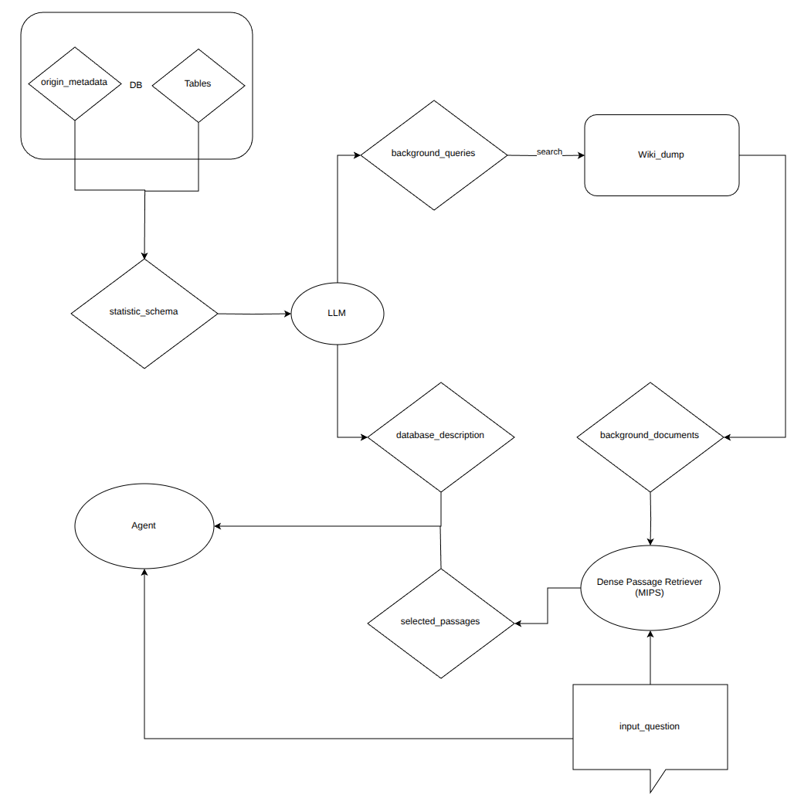

## 7.27
- background-documentSource1: wiki dump, link whole wiki-documents with database
- background-documentSource2: industry ducoments.
- database_description simulates the description human might input.
- RAG combined: use MIPS retriver,just encoders, selet top-k 100-word passages(Maximum Inner Product Search). 
 
## 7.29
- instead using column names to match querys to fetch the column description, using column descriptions' embedding vector to match queries' key words might be better.
- 1 paper Chess 
- feishu documents async
- building auto wiki search for dataset constructing 
## 7.30
- idea：考虑没有用户background_document输入的情况，后续直接用wiki_dump做模糊匹配搜索（需要87G
- idea: makeing LLM do references about ambigious metadata, making candidates, assign scores.
- 1work: add vector similarity module in document and subjuct.
- IDEA: self-RAG: training LM using special tokens while generating to determin weather do the search or not.
- IDEA: self-RAG的data-collection 可以作为参考文献：使用强LLM对原始训练语料进行标注：引入外部网络资料是否会帮助产生更好的结果：
```
Given an instruction, make a judgment on whether finding some external documents from the web helps to generate a better response.
```
## 7.31
- work: using mutiple searching candidates for more similarity results.
- investigate web search engine used in self-RAG Luo et al. (2023)
- COT论文